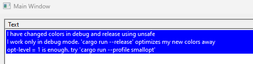
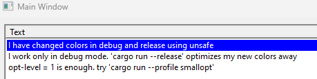
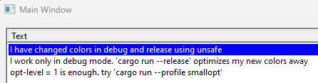

repro for https://github.com/rodrigocfd/winsafe/issues/106

## dev profile

```sh
❯ cargo run
   Compiling win32_custom_draw_issue v0.1.0 (D:\learning\win32_custom_draw_issue)
    Finished dev [unoptimized + debuginfo] target(s) in 0.30s
     Running `target\debug\win32_custom_draw_issue.exe`
```

Results in:



## dev profile + opt-level = 1

```sh
❯ cargo run --profile smallopt
   Compiling win32_custom_draw_issue v0.1.0 (D:\learning\win32_custom_draw_issue)
    Finished smallopt [optimized + debuginfo] target(s) in 0.35s
     Running `target\smallopt\win32_custom_draw_issue.exe`
```

Results in:



## release profile

```sh
❯ cargo run --release
   Compiling win32_custom_draw_issue v0.1.0 (D:\learning\win32_custom_draw_issue)
    Finished release [optimized] target(s) in 0.38s
     Running `target\release\win32_custom_draw_issue.exe`
```

Results in:


